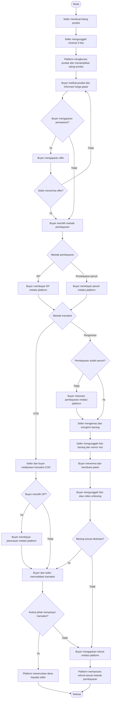

# PRD v1.0

## Ringkasan produk

Platform web untuk menjual dan membeli barang second-hand, dengan fokus awal pada produk fashion. Produk fashion dipilih karena lebih mudah dikurasi dan memiliki pasar yang cukup besar.

## Masalah yang ingin diselesaikan

1. Seller yang tidak memiliki media sosial harus bergantung pada Facebook Marketplace.
2. Seller sering mengalami kendala dengan buyer.
3. Facebook Marketplace tidak menyediakan mekanisme keamanan transaksi yang memadai.

## Fitur produk

### Penawaran harga

1. Seller dapat menentukan harga minimum penawaran untuk setiap produk.
2. Buyer dapat mengajukan penawaran harga berdasarkan batas minimum yang ditentukan seller.

### Pembayaran dan transaksi

1. Buyer dapat memilih pembayaran uang muka (DP) atau pembayaran penuh.
2. Buyer dan seller dapat memilih metode transaksi COD atau pengiriman.
3. Semua transaksi wajib dibuat dan diproses melalui platform.
4. Setelah buyer melakukan pembayaran, platform menahan dana sampai buyer dan seller memvalidasi transaksi.
5. Ketentuan pembayaran dan penyelesaian transaksi mengikuti [SLA transaksi](SLA.md).

### Pengiriman dan bukti transaksi

1. Seller wajib mengirimkan barang setelah barang selesai dikemas.
2. Untuk transaksi pengiriman, seller wajib mengunggah nomor resi ekspedisi ke platform.
3. Seller dapat mengunggah foto dan video barang sebelum dikirim.
4. Setelah menerima barang, buyer dapat mengunggah foto dan video saat membuka paket.

### Refund

1. Buyer dapat mengajukan refund melalui platform jika barang yang diterima tidak sesuai dengan deskripsi seller.
2. Untuk pembayaran DP, dana dikembalikan secara penuh sesuai ketentuan yang berlaku.
3. Untuk pembayaran penuh, pengembalian dana dipotong biaya platform sebesar 10%.

### Informasi harga pasar

1. Platform menampilkan median harga penjualan produk berdasarkan data transaksi.
2. Platform menampilkan grafik riwayat harga dalam periode mingguan, bulanan, dan tahunan.
3. Contoh: jika seller memposting Adidas Zero seharga Rp1.000.000, platform menampilkan riwayat harga mingguan, bulanan, dan tahunan untuk produk tersebut.
4. Platform menyediakan slider untuk membantu seller menentukan harga berdasarkan median harga pasar.
5. Platform menampilkan rentang harga dan indikator apakah harga produk tergolong layak atau tidak.
6. Informasi harga mempertimbangkan kondisi barang.

### Kurasi dan kondisi produk

1. Seller wajib mengunggah minimal tiga foto untuk setiap produk.
2. Platform memberikan rating untuk produk yang telah dikurasi.
3. Rating mencakup persentase kondisi barang serta penjelasan mengenai kelebihan dan kekurangannya.

## Flowchart transaksi

