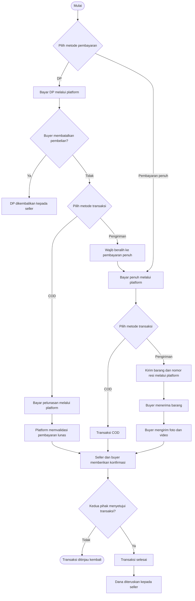

# SLA transaksi

## 1. Pilihan pembayaran

Buyer memilih salah satu opsi pembayaran:

1. Uang muka (DP)
2. Pembayaran penuh

## 2. Pembayaran dengan DP

1. Buyer membayar DP melalui platform.
2. Buyer memilih metode transaksi: COD atau pengiriman.
3. Untuk transaksi COD, buyer membayar pelunasan melalui platform.
4. Platform memvalidasi bahwa pembayaran sudah lunas.
5. Setelah pembayaran lunas dan transaksi divalidasi, dana diteruskan kepada seller.
6. Jika buyer membatalkan pembelian, DP dikembalikan kepada seller.

## 3. Pembayaran penuh

1. Buyer membayar penuh melalui platform.
2. Buyer memilih metode transaksi: COD atau pengiriman.
3. Dana diteruskan kepada seller setelah kedua pihak memberikan konfirmasi.

## 4. Ketentuan pengiriman

1. Transaksi dengan metode pengiriman wajib menggunakan pembayaran penuh.
2. Seller wajib mengirimkan nomor resi melalui platform untuk divalidasi.
3. Setelah menerima barang, buyer wajib mengirimkan foto dan video sebagai bukti penerimaan.

## 5. Penyelesaian transaksi

1. Platform meminta konfirmasi dari seller dan buyer.
2. Jika kedua pihak menyatakan transaksi sudah sesuai, transaksi dinyatakan selesai.
3. Platform meneruskan dana kepada seller.

## 6. Flowchart transaksi

